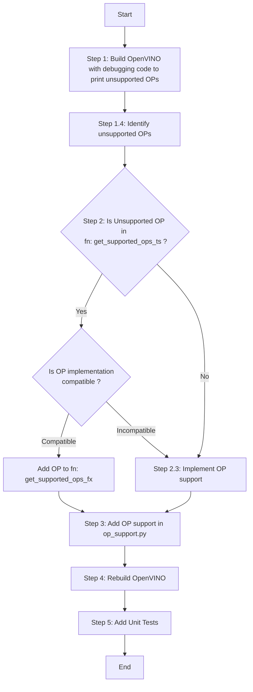

# How to Add OpenVINO Support to Unsupported Ops when using torch.compile with openvino backend.

##  Introduction

This guide covers the steps to add support for operations that are currently unsupported when using the OpenVINO  via [`torch.compile` feature](https://docs.openvino.ai/2023.2/pytorch_2_0_torch_compile.html). By following these steps, you can extend OpenVINO to support additional PyTorch operations via the TorchDynamo integration.

## Prerequisites

-   Knowledge of Python and C++ programming.
-   Familiarity with PyTorch, OpenVINO, [`torch.compile` feature](https://docs.openvino.ai/2023.2/pytorch_2_0_torch_compile.html).
-   [OpenVINO source code](https://github.com/openvinotoolkit/openvino) downloaded locally for modification.

## Step 1: Identify Unsupported OPs in TorchFX

### 1.1. Setup OpenVINO Source Code.
```bash
# Setup and activate Python Virtual Environment
python -m venv openvino_env
source openvino_env\Scripts\activate
python -m pip install --upgrade pip

# Download OpenVINO and install dependencies
git clone https://github.com/openvinotoolkit/openvino.git
cd openvino
git submodule update --init --recursive
chmod +x install_build_dependencies.sh
sudo ./install_build_dependencies.sh
```
### 1.2. Modify Code to Print Unsupported OPs.

- Update the `is_node_supported()` function in [op_support.py](https://github.com/openvinotoolkit/openvino/blob/master/src/bindings/python/src/openvino/frontend/pytorch/torchdynamo/op_support.py#L118) with the following which will print unsupported ops.

```python
    def is_node_supported(self, submodules: t.Mapping[str, Module], node: Node) -> bool:
        # OpenVINO FX subgraph should be purely functional
        if node.op not in CALLABLE_NODE_OPS:
            print(f":DEBUG - is_node_supported - target:{node.target}:supported:False")
            return False

        # ops in supported_dict doesn't have overload name
        # use overloadpacket's qualified_name for OpOverload
        if isinstance(node.target, OpOverload):
            target = _get_qualified_name(node.target.overloadpacket)

            if target in self._support_dict:
                print(f":DEBUG - is_node_supported - target:{node.target}:supported:True")
                return True
        res = super().is_node_supported(submodules, node)
        if res:
            print(f":DEBUG - is_node_supported - target:{node.target}:supported:True")
        else:
            print(f":DEBUG - is_node_supported - target:{node.target}:supported:False")
        return res
        # return super().is_node_supported(submodules, node)
```

### 1.3. Build OpenVINO
```bash
# Go to the OpenVINO root folder which was cloned before.
mkdir build && cd build
cmake .. -DCMAKE_BUILD_TYPE=Release -DENABLE_PYTHON=ON -DENABLE_WHEEL=ON
make -j4 # here 4 is used, modify it based on num threads on your system.
cd wheels
pip install openvino-20*

# Verify OpenVINO Package Is Installed
python -c "from openvino.runtime import Core; print(Core().available_devices)"
```

```bash
# By disabling unused features like below, build process may be faster.
cmake .. \
-DCMAKE_BUILD_TYPE=Release \
-DENABLE_PYTHON=ON \
-DENABLE_WHEEL=ON \
-DENABLE_MULTI=OFF \
-DENABLE_AUTO=OFF \
-DENABLE_HETERO=OFF \
-DENABLE_INTEL_GPU=OFF \
-DENABLE_INTEL_GNA=OFF
```

### 1.4. Run the application
Run the model with `torch.compile(model, backend="openvino")`, now with the debug statements, Identify Unsupported Operations.

## Step 2: Modify op_table.cpp

### 2.1. Open [op_table.cpp](https://github.com/openvinotoolkit/openvino/blob/master/src/frontends/pytorch/src/op_table.cpp).

### 2.2. Locate the following functions:
   - `get_supported_ops_ts()` (returns supported ops for TorchScript)
   - `get_supported_ops_fx()` (returns supported ops for TorchFX)

The process for adding support for unsupported operations is as follows:
1. Check if the unsupported OP is already supported in TorchScript by looking into `get_supported_ops_ts()` function.
2. If the unsupported OP is found in `get_supported_ops_ts()`, proceed to verify the implementation of the operation in [`op` directory](https://github.com/openvinotoolkit/openvino/tree/master/src/frontends/pytorch/src/op/) and ensure that the implementation is compatible with TorchFX.
3. If the implementation is compatible with TorchFX, add the OP to the function `get_supported_ops_fx()` in [op_table.cpp](https://github.com/openvinotoolkit/openvino/blob/master/src/frontends/pytorch/src/op_table.cpp). Example: `{"aten.bitwise_not.default", op::translate_bitwise_not}`
4. If the unsupported OP is not found in `get_supported_ops_ts()`, or if the implementation is not compatible with TorchFX, proceed to Step 2.3. This step involves implementing support for the unsupported operation.

### 2.3. Implement Unsupported OP Support
- If the unsupported OP is not in `get_supported_ops_ts()`, implement its functionality in the appropriate file or create a new file in the [`op` directory](https://github.com/openvinotoolkit/openvino/tree/master/src/frontends/pytorch/src/op/).
- Once the operation implementation is complete, define the corresponding OP_CONVERTOR in  [op_table.cpp](https://github.com/openvinotoolkit/openvino/blob/master/src/frontends/pytorch/src/op_table.cpp).
   ```cpp
   // Example for translate_transpose_fx
   OP_CONVERTER(translate_transpose_fx);
   ```
 - Finally, add the newly added OP in the `get_supported_ops_fx()` in [op_table.cpp](https://github.com/openvinotoolkit/openvino/blob/master/src/frontends/pytorch/src/op_table.cpp) as mentioned in Step 2.2.

## Step 3: Add OP Support to op_support.py

### 3.1. Open [op_support.py](https://github.com/openvinotoolkit/openvino/blob/master/src/bindings/python/src/openvino/frontend/pytorch/torchdynamo/op_support.py).

### 3.2. Add the newly supported OP to the `op_support_dict` in the `__init__` function.

   Example:
   ```python
   # Inside __init__ function in op_support.py
   "aten.bitwise_not.default": op.translate_bitwise_not,
   ```

## Step 4: Rebuild OpenVINO

- Rebuild the OpenVINO  to apply the changes.
- The unsupported OP should now be supported through `torch.compile(model, backend="openvino")`!

## Step 5: Add Unit Test Cases
- Add Unit Test cases for the implemented OP
  
## Flowchart


## Conclusion

Follow these steps to enable support for previously unsupported ops in the OpenVINO PyTorch using TorchDynamo. Thoroughly test the modifications to ensure correct functionality.
